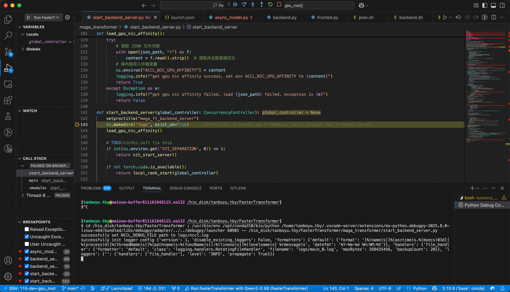
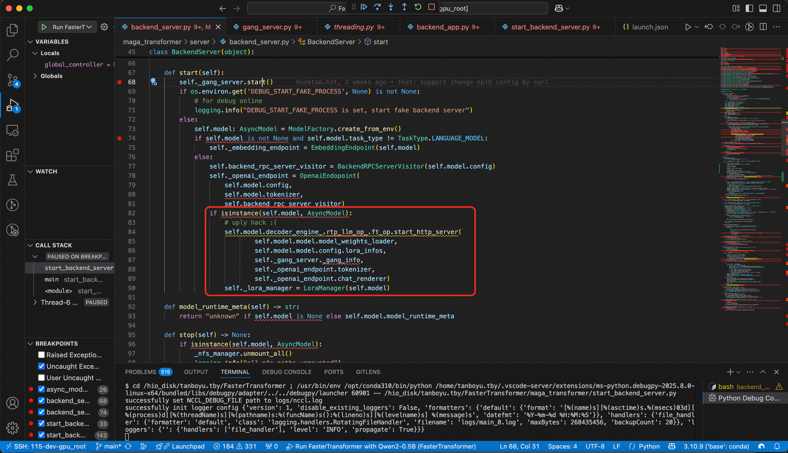
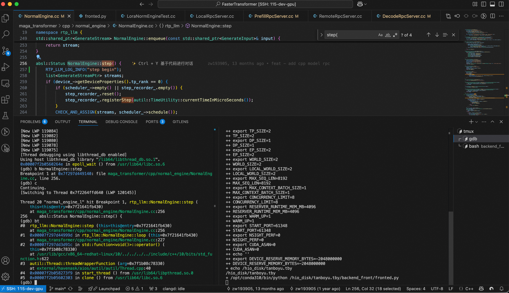

# RTP-LLM代码调试

RTP-LLM项目采取的是bazel的编译方式，在上一篇文章[从零开始编译运行RTP-LLM](./Build.md)当中我们已经学会了如何本地从0开始编译运行RTP-LLM，在这篇文章当中我们将会教会大家如何进行代码调试。RTP-LLM主要是由python和c++代码构成，因此我们在本文当中会介绍python源码调试和c++源码调试。

## 一. 测试代码准备
以本文使用为例，本章所有代码均放在hio_disk/tanboyu.tby/backend_front下面。

后端服务启动代码:
```python
## backend.py
import os
import sys
from threading import Thread
import requests
import time
import pathlib
import logging
import socket
from transformers import PreTrainedTokenizer
from typing import Dict, Optional

from maga_transformer.start_server import main as server_main
from maga_transformer.distribute.gang_info import members_from_test_env

for key, value in os.environ.items():
    print(f"start env {key}={value}")

current_file_path = pathlib.Path(__file__).parent.absolute()
sys.path.append(str(current_file_path.parent.parent.absolute()))

from maga_transformer.start_server import main as server_main
from maga_transformer.distribute.gang_info import members_from_test_env

tokenizer: Optional[PreTrainedTokenizer] = None
next_random_seed = int(os.environ.get("RANDOM_SEED", 114514))
max_seq_len = int(os.environ["MAX_SEQ_LEN"])

def wait_server_start(server_thread: Optional[Thread], port: int):
    start_time = time.time()
    while True:
        time.sleep(1)
        try:
            if server_thread and not server_thread.is_alive():
                raise SystemExit("Server thread dead!")
            res = requests.get(f"http://127.0.0.1:{port}/status")
            print(f"loop res: {res.text}")
            break
        except Exception as e:
            print(f"Waiting server on {port}, used {time.time() - start_time}s: {e}")
            continue
def wait_master_done(env_dict: Dict[str, str] = {}) -> None:
    dist_config_str = env_dict.get("GANG_CONFIG_STRING", os.environ.get("GANG_CONFIG_STRING"))
    if (not dist_config_str):
        raise RuntimeError("no gang config string, unexpected!")
    dist_members = members_from_test_env(dist_config_str)
    master_member = dist_members[0]
    master_host = master_member.ip
    master_port = master_member.server_port
    world_rank = int(os.environ.get("WORLD_RANK", 0))
    while True:
        logging.info(f"rank [{world_rank}] waiting for master {master_host}:{master_port} done")
        time.sleep(10)
        try:
            sock = socket.create_connection((master_host, master_port), timeout=1000)
            sock.close()
        except (socket.error, ConnectionRefusedError):
            break
    logging.info(f"rank [{world_rank}] master {master_host}:{master_port} done, this worker exit!")
    return

if __name__ == "__main__":
    port = int(os.environ["START_PORT"])
    world_rank = int(os.environ.get("WORLD_RANK", 0))

    server_thread = Thread(target=server_main)
    server_thread.start()
    print(f"server thread started, waiting...")
    wait_server_start(None, port)
    print(f"server start done!")
```

前端请求代码:
```python
## fronted.py
import os
import sys
import logging
import signal
import openai # you want `pip install openai==1.3.9`
from openai.types.chat import ChatCompletionMessageParam, ChatCompletionUserMessageParam
from typing import List
def script_exit(pgrp_set: bool = False):
    sys.stdout.flush()
    if pgrp_set:
        os.killpg(0, signal.SIGKILL)
        os._exit(0)
    else:
        os._exit(0)


if __name__ == '__main__':
    pgrp_set = False
    try:
        os.setpgrp()
        pgrp_set = True
    except Exception as e:
        logging.info(f"setpgrp error: {e}")

    openai.base_url = f"http://127.0.0.1:{int(os.environ['START_PORT'])}/"
    openai.api_key = "none"
    typed_messages: List[ChatCompletionMessageParam] = [
        ChatCompletionUserMessageParam(content="中国的首都是哪里?", role="user")
    ]

    response = openai.chat.completions.create(
        model="whatever",
        messages=typed_messages
    )
    print(f"response: {response}")
    script_exit(pgrp_set)
```
环境变量加载脚本:
```shell
## prev.sh
#!/bin/bash
set -x;
## 设定python的执行命令路径
export PYTHON_BIN=/opt/conda310/bin/python;
## 指定用户工作目录
export USER_HOME=/hio_disk/tanboyu.tby;
## 可以保证执行时立即打印日志
export PYTHONUNBUFFERED=TRUE;

## 项目导包使用的python路径
export PYTHONPATH=${USER_HOME}/FasterTransformer/:${PYTHONPATH}
## 指定日志路径
export PY_LOG_PATH=${USER_HOME}/FasterTransformer/logs

cd ${USER_HOME}/FasterTransformer

if [ $USE_COMPILE eq 1 ]; then
    ## 代码编译
    bazelisk build //maga_transformer:maga_transformer --compilation_mode=dbg --verbose_failures --config=cuda12_6 --keep_going --jobs=64 || {
        echo "bazel build failed";
        exit 1;
    };
fi

## 创建软连接，因为这两个文件是编译生成的
ln -s ${USER_HOME}/bazel-bin/maga_transformer/cpp/proto/model_rpc_service_pb2_grpc.py maga_transformer/cpp/proto/;
ln -s ${USER_HOME}/bazel-bin/maga_transformer/cpp/proto/model_rpc_service_pb2.py maga_transformer/cpp/proto/;

## 用户需自行下载 https://huggingface.co/Qwen/Qwen2-0.5B
export CHECKPOINT_PATH="/mnt/nas1/hf/Qwen2-0.5B";
export TOKENIZER_PATH=${CHECKPOINT_PATH}

export MODEL_TYPE="qwen_2";
export LD_LIBRARY_PATH=/opt/conda310/lib/:/usr/local/nvidia/lib64:/usr/lib64:/usr/local/cuda/lib64:/usr/local/cuda-12.6/extras/CUPTI/lib64/

# export FT_SERVER_TEST=1
## 设置TP并行度
export TP_SIZE=2
## 设置DP并行度
export DP_SIZE=1
## 设置EP并行度
export EP_SIZE=$((TP_SIZE * DP_SIZE))
## 参见docs/MultiGPU.md
export WORLD_SIZE=$EP_SIZE
## 参见docs/MultiGPU.md
export LOCAL_WORLD_SIZE=$EP_SIZE
## 用户请求的最大文本token数量
export MAX_SEQ_LEN=8192
## 模型一次性处理的最大上下文大小
export MAX_CONTEXT_BATCH_SIZE=1
## 并发限制
export CONCURRENCY_LIMIT=8

## RUNTIME内存容量限制
export RESERVER_RUNTIME_MEM_MB=4096
## 用于GPU内存分区为两份,一份用于KV-Cache,一份用于计算
export WARM_UP=1
## 服务启动端口号
export START_PORT=61348
## 是否开启性能打样
export NSIGHT_PERF=0
## 是否开启CUDA ASAN, 用于内存检测
export CUDA_ASAN=0

echo "" > logs/engine.log;

export DEVICE_RESERVE_MEMORY_BYTES=-2048000000;
```

后端启动脚本:
```shell
## backend.sh
export USE_COMPILE=1
source prev.sh
echo "user_home: $USER_HOME"
$PYTHON_BIN ${USER_HOME}/backend_front/backend.py
```

前端启动脚本:
```shell
## fronted.sh
export USE_COMPILE=0
source prev.sh
echo $USER_HOME
$PYTHON_BIN ${USER_HOME}/backend_front/fronted.py
```
## 二. Python代码调试
我们采用vscode进行代码开发调试，python代码调试比较方便使用图形化界面进行处理，比较直观。下面是进行launch调试的配置文件:
```json
// launch.json
{
    "version": "0.2.0",
    "configurations": [
        {
            "name": "Run FasterTransformer with Qwen2-0.5B",
            "type": "debugpy",
            "request": "launch",
            // "processId": "${command:pickProcess}", // 使用用户选择的进程
            "program": "${file}",
            // "console": "integratedTerminal",
            "cwd": "/hio_disk/tanboyu.tby/FasterTransformer",
            "env": {
                "CUDA_VISIBLE_DEVICES": "2,3",
                "CHECKPOINT_PATH": "/mnt/nas1/hf/Qwen2-0.5B",
                "TOKENIZER_PATH": "/mnt/nas1/hf/Qwen2-0.5B",
                "MODEL_TYPE": "qwen_2",
                "LD_LIBRARY_PATH": "/opt/conda310/lib/:/usr/local/nvidia/lib64:/usr/lib64:/usr/local/cuda/lib64:/usr/local/cuda-12.6/extras/CUPTI/lib64/",
                "TP_SIZE": "2",
                "DP_SIZE": "1",
                "EP_SIZE": "1",  // 手动计算 EP_SIZE = TP_SIZE * DP_SIZE
                "WORLD_SIZE": "2",  // 与 EP_SIZE 一致
                "LOCAL_WORLD_SIZE": "1",  // 与 EP_SIZE 一致
                "MAX_SEQ_LEN": "1024",
                "MAX_CONTEXT_BATCH_SIZE": "1",
                "CONCURRENCY_LIMIT": "8",
                "RESERVER_RUNTIME_MEM_MB": "4096",
                "WARM_UP": "1",
                "START_PORT": "61348",
                "NSIGHT_PERF": "0",
                "CUDA_ASAN": "0"
            },
            "args": []
        },
    ],
}
```
在进行调试的时候，需要界面回到/backend_front/backend.py即可，然后我们可以正常进行调试。

实际上代码最后正常执行的会到这里来，这里底层就是调用的maga_transformer/cpp下面的c++代码来启动LocalRpcServer。


## 三. 服务端代码调试
首先需要启动服务: bash backend.sh，最后下面这样就算服务启动成功。

查看相关启动进程如下:
```shell
[tanboyu.tby@mainse-buffer011161048115.na132 /hio_disk/tanboyu.tby/FasterTransformer]
$ps aux | grep rtp_llm
tanboyu+  21090  5.7  0.1 41536432 1105896 pts/20 Sl+ 23:55   0:15 rtp_llm_backend_server
tanboyu+  21251 54.8  0.8 136379296 6902104 pts/20 Sl+ 23:55   2:24 rtp_llm_rank-0
tanboyu+  21252  122  0.8 142631432 6953340 pts/20 Sl+ 23:55   5:22 rtp_llm_rank-1
tanboyu+  22451  5.8  0.1 50260920 1167256 pts/20 Sl+ 23:56   0:11 rtp_llm_frontend_server_0
tanboyu+  22452  5.8  0.1 50260936 1175892 pts/20 Sl+ 23:56   0:11 rtp_llm_frontend_server_1
tanboyu+  22453  5.6  0.1 50260920 1172820 pts/20 Sl+ 23:56   0:11 rtp_llm_frontend_server_2
tanboyu+  22454  5.5  0.1 50259900 1167200 pts/20 Sl+ 23:56   0:10 rtp_llm_frontend_server_3
tanboyu+  23916  0.0  0.0   7996   900 pts/16   S+   23:59   0:00 grep --color=auto rtp_llm
```
服务启动之后，我们会发现存在一个rtp_llm_backend_server进程，这是推理服务启动的主进程，而rtp_llm_rank-0和rtp_llm_rank-1则是对应的子进程，这个数量是由我们的配置决定的，我们设置了TP_SIZE = 2所以这个地方会有对应的两个进程。另外还会默认启动四个rtp_llm_frontend_server前端服务进程，用于接受外部请求。

接下来我们开始进行gdb调试: gdb -p 21251，打完断点后，执行bash fronted.sh ，就会命中断点， 然后我们可以根据堆栈查看代码路径。
