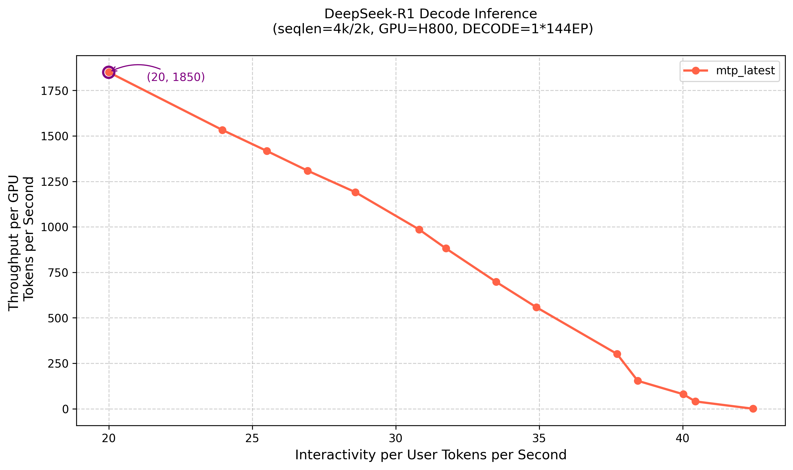
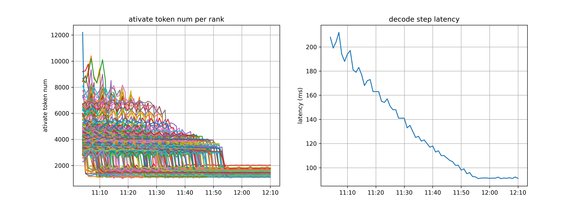
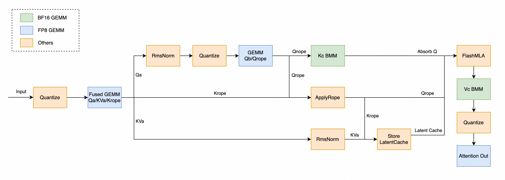

# RTP-LLM DeepSeek Replay Tech Report

# Overview

 DeepSeek-V3 在多个评测中展现出强大性能，成为当前最受关注的开源大模型之一。由于采用了大规模 MoE 架构，如何优化推理性能，是工程落地上的关键难点。DeepSeek 团队于 2 月相继开源了 DeepEP、DeepGEMM、FlashMLA、EPLB 等关键组件。在开源社区工作的基础上，我们在RTP-LLM上完成了优化工作，对齐了 DeepSeek 推理系统的性能。

RTP-LLM 是阿里巴巴爱橙科技研发的 LLM 推理加速引擎，主要服务阿里集团内部业务。本文将分享实现过程中的一些关键技术点、不足和思考，以此感谢开源社区对我们的帮助。相关代码正在整理和重构中，不久之后会更新完整的代码和复现方法。

根据 [DeepSeek Inference System Overview](https://github.com/deepseek-ai/open-infra-index/blob/main/202502OpenSourceWeek/day_6_one_more_thing_deepseekV3R1_inference_system_overview.md)的介绍

:::
Total input tokens: 608B, of which 342B tokens (56.3%) hit the on-disk KV cache.

Total output tokens: 168B. The average output speed was 20–22 tokens per second, and the average kvcache length per output token was 4,989 tokens.

Each H800 node delivers an average throughput of ~73.7k tokens/s input (including cache hits) during prefilling or ~14.8k tokens/s output during decoding.
:::

**DeepSeek 推理系统在实际生产服务中， Prefill 吞吐为 3****2.2K per H800 node**，**Decode 吞吐为 14.8K TPS per H800 node**。在 RTP-LLM 测试中，我们使用 4K input/2K output，**在 1.6s TTFT 和 50ms ITL 约束下，达到了 Prefill** **42.6K** **TPS per H800 node， Decode** **14.7K** **TPS per H800 node 的性能**。

# Test results

## Settings

我们在**阿里云****灵骏 H800 RoCE 环境，采用** **PD 分离和分布式 EP 架构部署**，设置 TP=1，DP=EP=卡数。Prefill 单实例规格为 4 节点 32 卡，Decode 单实例规格为 18 节点 144 卡。测试过程中，我们使用了 4 实例 Prefill 和 1 实例 Decode ，共 272 卡 H800。

测试采用了 4:1 的 PD 实例比例，这并不是最完美的 PD 配比。在实际生产负载中，会面临更复杂的输入输出长度波动，需结合调度系统，动态弹性地调整 PD 实例数。

## Prefill

Prefill 实例采用 32 EP 部署。极限压力下，单卡执行 2 个 4K Request耗时1.5s，吞吐为 5333 TPS。

测试中没有模拟Cache的影响，这是后续需完善的工作之一。

**RTP-LLM 也支持 TP/DP/EP 混合部署，推荐在 H800 高算力卡上使用 TP=1；在 H20 等算力受限卡上，根据延迟约束选择 TP=2/4。**

## Decode

Decode 实例采用144 EP 部署（128 + 16 冗余）。因实现差异，Host用时快 2ms，Device 上则略慢，分析原因是 RoCE 与 IB 网络差异、未实现 CUDA Graph 优化以及部分 Kernel 实现较慢。这也是后续优化方向。

上图为 Decode 阶段压测曲线。在较低并发下，单用户可达 42 TPS。在13200 并发时，达到单用户 20 TPS 的 SLA 界限，此时单卡吞吐为1850 TPS。

在 DeepEP 开源之前，我们通过 All2All 实现了分布式 EP，对比单机也有非常好的吞吐提升，但延迟过高。除网络延迟高之外，All2All 带来了非常严重的 Host 同步开销，亦不利于重叠网络和计算时间。**建议不支持 DeepEP 机制的 GPU 可以等价地实现 Pure Device All2All，以达到接近的性能；而 ASIC加速卡可更进一步，直接做 MoE/Dispatch/Combine 的 Overlap。**

# Implementation and Tricks

## EPLB

下图为 EPLB 对延迟的影响测试。我们发现 EP 均衡状态受测试数据影响较大，**测试数据也并不能完全模拟真实应用的负载状态**。EP 负载策略仍然是未来要深入探索的一个方向。

## MicroBatch & Overlapping

为使 GPU 计算和网络通信互相覆盖，我们完整实现了Prefill/Decode Micro Batching 方案，并接入了 DeepEP 的 Overlap 机制。过程中，我们有以下发现：

1.  无论是 Prefill 还是 Decode，由于 Dispatch 阶段传输的是 FP8 tensor 而 Combine 阶段传输的是 FP16 tensor，Combine 阶段的通信耗时会显著高于 Dispatch。因此，**在设计 Overlap 方案时，需要考虑用更大块的时间遮盖 Combine 部分通信。未来，在推理阶段引入量化通信，是一个可以考虑的改进方向。**
    

2.  对于 Prefill 来说，Attention 花费的时间占比相对较短，最终 Attention+MoE gate 部分和 MoE MLP 花费的时间相差不大，两部分都可以遮盖 Combine 阶段比较长的通信时间，只需要将请求切分后，两个 MicroBatch 的计算/通信互相穿插即可。值得注意的细节是 **Shared Expert 计算总是被覆盖在了 Combine 的部分里，以保证覆盖 Combine 的计算时间比 Dispatch 更多**。
    

考虑 Qwen3 模型，虽然没有 Shared Expert，在 Decode 阶段仍然可以采用同样的 Overlap 方案，以 Attention 算子为界，在其中插入 MLP 计算，前后分别遮盖 Dispatch 和 Combine 的通信时间。框架层面，为兼容包括 DeepEP 的两种模式和 Vanilla All2All 通信的 Overlap 功能，并考虑扩展到多种不同硬件，我们开发了**统一的通信回调接口，MicroBatch 能力可以轻松扩展到其他加速卡上。**

## MTP

我们在先前实现的[通用投机采样框架](https://mp.weixin.qq.com/s/EiSRF2ORy22I1pimCCvcPQ)中增加了 MTP 投机采样支持。MTP 是 DeepSeek ITL 优化中最关键的一环。Decode 阶段增大算力强度的唯一办法就是增大 GEMM BS。**KV Cache 容量限制了 Global BS，MTP 只需要原来 BS/2 就可以获得跟原来一样的算力强度**。计算通信 Overlap 需要开启 MicroBatch，副作用是延迟上升。**MTP 可以降低平均 ITL，将 MicroBatch 造成的延迟补偿回来**。一举两得。

## PD Disaggregation

在DeepSeek-V3 模型中，因为 Prefill 和 Decode 算力需求差别较大、EP 策略不同，PD 分离部署是必然选择。我们扩展**支持了 Prefill-Decode 不同 TP 规格的部署，这对低算力卡尤其重要。**我们实现了两种 PD 负载均衡策略，基于 KV Cache 均衡和基于 BS 均衡。测试数据的 BS Variance 较小，高压力下、 **EP 流量较高时，BS 均衡对 Dispatch/Combine 延迟更加重要**。在生产环境中，需要综合考虑 BS Variance 和 Seq Variance 因素，或更进一步按流量特点进行 Decode 实例拆分。

## DeepEP / Network

DeepEP 主要针对 IB 环境优化，在面对实际生产中多样的底层环境和技术栈时，为能工程落地和达到最优的性能，我们做了如下的优化和改进：

1.  双上联性能修复：通过深入分析Normal kernel（少QP、大消息）和 Low latency kernel（多QP、小消息）的特点，在不引入性能开销的前提下，提供纯 IAAS 层的修复功能。具体来说，我们在NVSHMEM层提供了分别针对Normal kernel和Low Latency kernel的消息级和队列级负载均衡方案，优化后的版本在保持了双上联带来的稳定性优势的同时，在通信性能方面可以持平甚至略优于IB网络的单上联方案。
    

2.  通信模式优化：协同考虑机内机间的网络架构，优化机内机间的流量 pattern，充分利用系统中的可用链路，实现网络轨道和平面之间的流量均衡，避免网络流量的冲突碰撞，最大化全系统的通信效率，在 Low Latency 通信模式下，通信延时下降可达60%+。
    

3.  机内拓扑自修复能力：机内拓扑汇报异常会影响网卡与显卡间的通信链路，导致网络性能受损。为了解决这个问题，我们实现了机内拓扑自修复功能，对上屏蔽了底层服务器软硬件差异，确保了不同机型下GPU和网卡的亲和性关系。
    

4.  虚拟化环境适配：为灵活支持复杂多变的业务场景，我们支持了基于商卡硬件SRIOV虚拟化的高性能网络方案，解决了SRIOV和DeepEP的适配问题，通过优化使得VF和PF性能一致并完成大规模上线。
    

## CUDA Kernel Fusion

我们针对 CUDA Kernel 执行流进行了细致的分析，并针对 模型 特点进行了优化：

1.  **将部分矩阵乘移至 BF16 格式计算。**FP8 矩阵乘由于需要引入量化操作，在规模不够时开销更大。
    
2.  将 Rotary Embedding 中的转置提前到加载权重时，避免引入 Elementwise 算子。
    
3.  Fuse GEMM 计算前的 Quantization 和 Transpose。
    
4.  后续计划进行 Fuse Activation 和 Quantization。
    

## PDL

Hopper 架构上引入了 Programmatic Dependent Launch (PDL)，允许同一条 CUDA Stream 上先后两个相邻的 Kernel 重叠执行，从而在前一个 Kernel 正在执行的情况下，后一个 Kernel 可以提前完成初始化等工作。通过在 GEMM Kernel 中引入 PDL，**我们就可以实现在 Quantization 等 Kernel 计算的过程中，提前执行** GEMM **的初始化操作，提升系统的整体性能。**

PDL 的引入还为 Kernel 层面的优化带来了更多的可能性，如 GEMM **的 Weight Prefetch**。在 PDL 重叠 Quantization 等操作与 GEMM 之后，可以在 GEMM Kernel 重叠的部分添加对 Weight 的 Prefetch 操作，使得实际执行 MMA 时，所需的 Weight Tensor 已经位于 L2 缓存中，达到加速 GEMM Kernel 的目的。

## Framework Overhead

整体框架 Overhead 主要集中在两部分，**一部分是相邻 Forward Step 之间的 Host 开销，在 1.5ms 左右；另一部分是 Kernel Launch Overhead 开销，在 2ms 左右**。

Forward Step 间的 Host 开销主要问题是我们 Dynamic Batch 的实现臃肿，性能开销和 BS 线性相关。我们将  Dynamic Batch 的实现轻量化，除了下一个 Step 依赖的之外的操作都进行异步或者多线程处理。理想情况下，128 BS 的情况下做到 200us 以内。目前 Host 开销过大有很大一部分是由于 MTP 情况下多了一次 Dynamic Batch 导致的，可以进一步优化掉。

**Kernel Launch Overhead 主要原因是 GPU Kernel 数量过多。**开启 MicroBatch 情况下 GPU Kernel 数量翻倍，问题更加严重。这种情况比较好的解决方案就是 CUDA Graph。这里需要权衡性能和架构复杂度。RTP-LLM 框架通过 C++ 实现已经规避了 Host 端 Launch Overhead 问题。但我们观测到，**即使是 Launch 速度远超 Kernel 执行速度，GPU Device 层面仍然存在一定 Launch Overhead**，CUDA Graph 可以一定程度规避。**我们期待 NVIDIA 在未来的驱动或者硬件版本上能够较为彻底地解决这一问题。**

## Weights Loading

模型权重加载速度直接影响研发和部署效率。针对 671B 的权重，我们通过优化实现了**分钟级加载**，具体方案如下：

1.  **权重预处理与格式预转换**。RTP-LLM 加载时需对 Weight 进行 Split、Transpose 等操作。我们设计预处理系统将原始权重提前转换为框架所需的 Weight 格式。经预处理后消除了加载时的计算开销。
    

2.   **Direct IO + Pinned Memory 加速大文件读取**。针对单个权重文件超百 GB 的 IO 瓶颈，采用 Direct IO 绕过系统 Page Cache 机制，通过 CUDA Pinned Memory 建立固定内存池，消除内核态与用户态间的多次内存拷贝。
    

# Limitations and Future Work

1.  在算子性能方面，我们尚未完全与 DeepSeek 对齐，诸如 Prefill Attention、Decode Quantization 等核心算子的运行速度存在一定差距，亟需进一步优化。此外，CUDA Graph 也是一个关键的改进方向。
    

2.  EPLB 本质上需要算法设计与系统工程的深度协同，目前尚无普适且高效的解决方案。针对特定应用场景下的动态负载分布特性，仍需进一步探索更具适应性和鲁棒性的负载均衡策略。
    

3.  MicroBatch 并非计算通讯 Overlap 的唯一方案。结合诸如 FLUX 和 Triton-distributed 等优秀工作，多种并行模式融合，是未来值得探索的方向。
    

4.  在 DeepSeek-V3上，Pure EP 方案较好地匹配了 6K 长度的短序列任务。面对更长序列的场景，受限于 KV Cache 容量，为提升 MoE 计算效率，需要设计更精巧的并行模式。
    

5.  在大规模测试与部署实践中，我们观察到多次因单卡故障导致整个 144 卡 Decode 实例失效的问题。为此，我们在 PD 分离架构中引入 ACCL 结合服务发现机制，构建了具备弹性和高可用性的 Serverless PD 服务。我们计划在未来进一步结合任务调度器与通信库能力，构建具备高容错和弹性伸缩能力的 Serverless CCL（Collective Communication Library）框架。
    

6.  与 H800 不同，我们生产环境中可规模化应用的异构计算卡普遍算力较低， 此时如何在 TTFT 和 ITL 约束下优化吞吐，是一个极具挑战的问题。同时，如何在多种卡型、多个代系的卡上都优化到较好的性能，也是我们要努力解决的问题。
    

# For Qwen3 MoE

Qwen3-235B-A22B 相较于 DeepSeek-V3 在模型尺寸上更小，支持无缝切换 Thinking Mode。在 4K Input/2K Output 场景，可采用相似的优化策略，结合具体模型参数配置调整并行模式。

从 KV Cache 占用角度，Qwen3-235B-A22B 的 per token KV Cache 开销为 94×4×128×2=96KB，而 DeepSeek-V3 为 61×1536=93KB，两者接近。

从 Attention 计算延迟角度，Qwen3-235B-A22B 采用 64 头 GQA，相较于 DeepSeek-V3 的 128 头 MLA，计算延迟约为后者的 50%。考虑到访存延迟的影响，实际延迟会略高。

Dispatch/Combine 通信角度，Qwen3-235B-A22B约为 DeepSeek-V3的40%。

从 MoE GEMM 计算延迟角度，因Qwen3-235B-A22B参数规模为40%-50%，计算延迟约为50%。

综上，在大规模集群部署中，从 KV Cache 容量限制和 MoE 算力利用率两个维度综合评估，Qwen3-235B-A22B 可采用类似的部署模式。相较 DeepSeek-V3，Qwen3-235B-A22B 能够支持更长的序列长度，在延迟和吞吐上有更好的表现。对于H20等算力受限卡，可考虑缩小 EP、引入 TP，降低网络延迟的同时亦可以做到较好的算力利用率。

# Thanks

通过两个月的不断努力，我们对齐了 DeepSeek 推理引擎的性能。感谢开源社区分享了 DeepSeek、Qwen、Llama 等优秀的开源模型，以及 FasterTransformer、TensoRT-LLM、FlashAttention、FlashInfer、Transformers、vLLM、SGLang 等优秀的工程引擎和优化。我们相信开源、开放、交流是实现 AGI 的必由之路。希望通过与社区深入地讨论交流，共同推动 AI 技术的创新突破与生态繁荣。