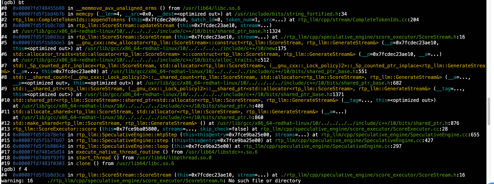
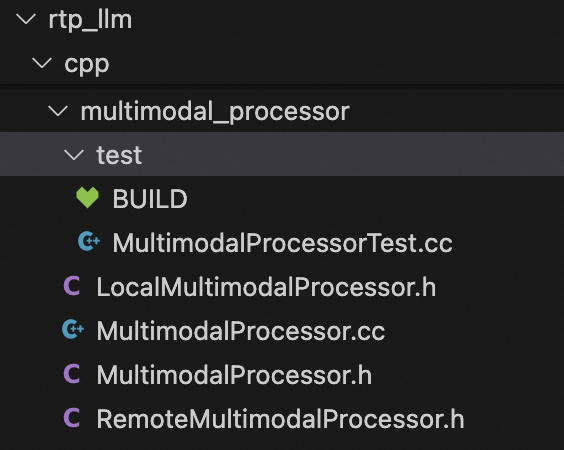

# Debugging RTP-LLM

The RTP-LLM project uses the Bazel build system. After learning how to compile and run RTP-LLM locally from scratch, this article will explain how to debug the code. Since RTP-LLM is primarily composed of a combination of Python and C++ code, we will introduce several commonly used debugging methods in this guide.

## Part 1: debug Python Code

### Method 1: logging or print

When running the debug mode locally, modify the self.frontend_server_count = 4 to 1 in the ServerConfig class within rtp_llm/config/py_config_modules.py. This change ensures only one frontend server is launched, allowing print statements and logging outputs to be directly displayed in the terminal.


### Method 2: python debugger
Assuming we already have an existing container, access it and set up an SSH port mapping to enable remote connections.
```bash
sudo ssh-keygen -A
sudo /usr/sbin/sshd -p 37228
```
Access the container via the SSH extension in VS Code.

```bash
Host dev-container
    HostName ip
    User user
    Port 37228
```
After accessing the container via VS Code, ensure the Python debugger extension is installed within the container.


Write the launch.json configuration file for debugging.
Here’s an example of a VS Code launch.json configuration file for debugging Python and C++ code in the RTP-LLM project (adjust paths as needed):
```json
{
    "version": "0.2.0",
    "configurations": [
        {
            "name": "Run RTP-LLM with Qwen2-0.5B",
            "type": "debugpy",
            "request": "launch",
            "program": "${file}",
            "cwd": "${path/to/project}/RTP-LLM/",
            "env": {
                "PYTHONPATH": "$PYTHONPATH:${path/to/project}/RTP-LLM",
                "PYTHON_BIN": "/opt/conda310/bin/python",
                "CUDA_VISIBLE_DEVICES": "2,3",
                "CHECKPOINT_PATH": "/mnt/nas1/hf/Qwen2-0.5B",
                "TOKENIZER_PATH": "/mnt/nas1/hf/Qwen2-0.5B",
                "MODEL_TYPE": "qwen_2",
                "LD_LIBRARY_PATH": "",
                "TP_SIZE": "2",
                "DP_SIZE": "1",
                "EP_SIZE": "2",
                "WORLD_SIZE": "2",
                "LOCAL_WORLD_SIZE": "1",
                "MAX_SEQ_LEN": "1024",
                "MAX_CONTEXT_BATCH_SIZE": "1",
                "CONCURRENCY_LIMIT": "8",
                "RESERVER_RUNTIME_MEM_MB": "4096",
                "WARM_UP": "1",
                "START_PORT": "61348",
                "NSIGHT_PERF": "0",
                "CUDA_ASAN": "0"
            },
            "args": []
        },
    ],
}
```
Set up the required environment variables before running or debugging the code.

```bash
#!/bin/bash
set -x;
## set python path
export PYTHON_BIN=/opt/conda310/bin/python;
## set user home
export USER_HOME=${/path/to/home};

export PYTHONUNBUFFERED=TRUE;
export PYTHONPATH=${path/to/project}/:${PYTHONPATH}

export PY_LOG_PATH=${path/to/project}/logs
export CHECKPOINT_PATH="/mnt/nas1/hf/Qwen2-0.5B";
export TOKENIZER_PATH=${CHECKPOINT_PATH}
export MODEL_TYPE="qwen_2";
export LD_LIBRARY_PATH=/opt/conda310/lib/:/usr/local/nvidia/lib64:/usr/lib64:/usr/local/cuda/lib64:/usr/local/cuda-12.6/extras/CUPTI/lib64/

export TP_SIZE=2
export DP_SIZE=1
export EP_SIZE=$((TP_SIZE * DP_SIZE))
export WORLD_SIZE=$EP_SIZE
export LOCAL_WORLD_SIZE=$EP_SIZE
## request max token number
export MAX_SEQ_LEN=8192
export MAX_CONTEXT_BATCH_SIZE=1
export CONCURRENCY_LIMIT=8

export RESERVER_RUNTIME_MEM_MB=4096
export WARM_UP=1
export START_PORT=61348
export NSIGHT_PERF=0
export CUDA_ASAN=0
export DEVICE_RESERVE_MEMORY_BYTES=-20480000

```

open the file containing start_server.py, set breakpoints, and begin debugging.


## Part 1: debug c++ code
### Method 1: logging
Add the following log statements for output:
```cpp
RTP_LLM_LOG_DEBUG("request [%ld] enqueue success", request_id);
```
other similar functions include:
```cpp
RTP_LLM_LOG_INFO
RTP_LLM_LOG_WARNING
RTP_LLM_LOG_ERROR
```
Set the log level using the LOG_LEVEL="INFO" environment variable.

### Method 2: GDB debug
#### GDB debug core
When the code crashes with a core dump in the container, a core file is generated (e.g., core-rtp_llm_backend-78933-1757510512). To debug:
```
gdb /opt/conda310/bin/python3 core-rtp_llm_backend-78933-1757510512
```
After loading the core file into GDB, run the bt (backtrace) command to display the error stack trace.



```bash
f 4       # check rtp_llm::ScoreStream::ScoreStream info
info locals
p stream
```


check propose_stream_ info

```
p *(this->propose_stream_._M_ptr->sp_output_buffer_._M_ptr->tokens._M_ptr)
```

check tokens info


A null pointer (data_ = 0) was detected, causing a memcpy error.

#### GDB debug process

```bash
MODEL_TYPE=qwen_7b     \
CHECKPOINT_PATH=/mnt/nas1/hf/Qwen-7B-Chat/     \
TOKENIZER_PATH=/mnt/nas1/dm/qwen_sp/qwen_tokenizer     \
TP_SIZE=1     \
SP_TYPE=vanilla     \
GEN_NUM_PER_CIRCLE=5     \
SP_MODEL_TYPE=qwen_1b8     \
SP_CHECKPOINT_PATH=/mnt/nas1/hf/qwen_1b8_sft/     \
WARM_UP=1     \
INT8_MODE=1     \
SP_INT8_MODE=1     \
REUSE_CACHE=1     \
START_PORT=26666   \
/opt/conda310/bin/python3 -m rtp_llm.start_server
```

After starting the service, you can view the relevant processes as follows:


A rtp_llm_backend_server process will be running as the main process for the inference service. If TP_SIZE=2 is set, you will see two child processes (e.g., rank-0 and rank-1) for tensor parallelism.
A rtp_llm_frontend_server_0 frontend service process will be active to handle external requests.

```bash
yanxi.w+  40954  40801 44 14:03 pts/8    00:00:41 rtp_llm_backend_server
yanxi.w+  41356  40801 20 14:04 pts/8    00:00:11 rtp_llm_frontend_server_0
```

To begin debugging with GDB:
Attach GDB to the target process (e.g., PID 40954):
```
gdb -p 40954
```
Set breakpoints in the code
Use curl to send a test request and trigger the breakpoint:

``` bash
curl -X POST http://127.0.0.1:26000/v1/chat/completions   -H "Content-Type: application/json"   -d '{
    "messages": [
      {
        "role": "user",
        "content": "杭州的天气怎么样？"
      }
    ],
    "stream": false,
    "aux_info": true,
    "max_tokens": 10
  }'
```
The breakpoint will be triggered, and you can then examine the code path by inspecting the stack trace.


### Method 3: Unit Test

Example: Unit Testing for the ViT Module

File Structure of the ViT Module



Steps to Create Unit Tests
Create Test Files:

Add a .cc test file (e.g., multimodal_processor_test.cc) under the test directory.
Write Google Test (gtest) cases using assertions like EXPECT_EQ to validate behavior.
```cpp
#include <gtest/gtest.h>
TEST(MultimodalProcessorTest, BasicFunctionality) {
  // Test logic here
  EXPECT_EQ(result, expected_value);
}
```
Define the BUILD File:

```python
cc_test(
    name = "multimodal_processor_test",
    srcs = ["multimodal_processor_test.cc"],
    deps = [
        "//rtp_llm/cpp/multimodal_processor:main_lib",
        "@gtest//:gtest_main",
    ],
)

```
Run the Test:
Execute the following command in the project’s container:
```bash
bazelisk test  rtp_llm/cpp/multimodal_processor/test:multimodal_processor_test   --jobs=48 --test_output=streamed --config=cuda12_6
```

## Part 3: bazel smoke test

Add Smoke Test Cases:

In rtp_llm/test/smoke/BUILD, define smoke test targets.
Extend case_runner.py to include new API endpoints and comparers.

```python
...
    elif request_endpoint.startswith("/rtp_llm/worker_status"):
        comparer_cls = WorkerStatusComparer
...
```

Implement the Comparer:

```python
    def compare_result(
        self, expect_result: WorkStatus, actual_result: WorkStatus
    ) -> None:
```
Prepare Test Data:

Place JSON files (e.g., expected_worker_status.json) in the smoke test directory for result validation.

Run Smoke Tests:

```
bazelisk test internal_source/rtp_llm/test/smoke:worker_status_reuse_cache  --config=ppu --test_env='CUDA_VISIBLE_DEVICES=11,12,13' --cache_test_results=no
```


## Part 4: curl request with debugging options

To retrieve debugging information via a curl request, use the following command with verbose output:

Enabling aux_info: true and debug_info: true in the request will return additional auxiliary information and debugging details.

```
curl -X POST http://127.0.0.1:26000/v1/chat/completions   -H "Content-Type: application/json"   -d '{
    "messages": [
      {
        "role": "user",
        "content": "杭州的天气怎么样？"
      }
    ],
    "stream": false,
    "aux_info": true,
    "max_tokens": 10,
    "debug_info": true
  }'
```
response:

```
{
  "id": "chat-",
  "object": "chat.completion",
  "created": 1757660643,
  "model": "",
  "choices": [
    {
      "index": 0,
      "message": {
        "role": "assistant",
        "content": "杭州的天气通常是比较湿润的，春秋季节",
        "partial": false
      },
      "finish_reason": "length"
    }
  ],
  "usage": {
    "prompt_tokens": 34,
    "total_tokens": 44,
    "completion_tokens": 10
  },
  "debug_info": {
    "input_prompt": "<|im_start|>system\nYou are Qwen, created by Alibaba Cloud. You are a helpful assistant.<|im_end|>\n<|im_start|>user\n杭州的天气怎么样？<|im_end|>\n<|im_start|>assistant\n",
    "input_ids": [
      151644, 8948, 198, 2610, 525, 1207, 16948, 11, 3465, 553, 54364, 14817, 13,
      1446, 525, 264, 10950, 17847, 13, 151645, 198, 151644, 872, 198, 104130,
      9370, 104307, 104472, 11319, 151645, 198, 151644, 77091, 198
    ],
    "input_urls": [],
    "tokenizer_info": "Qwen2TokenizerFast(...完整tokenizer信息...)",
    "max_seq_len": 16384,
    "eos_token_id": 151645,
    "stop_word_ids_list": [[151645], [151644], [37763, 367, 25], [151643]],
    "stop_words_list": ["<|im_end|>", "<|im_start|>", "Observation:", "<|endoftext|>"],
    "renderer_info": {
      "class_name": "QwenRenderer",
      "renderer_model_type": "qwen_2",
      "extra_stop_word_ids_list": [[37763, 367, 25], [151643]],
      "extra_stop_words_list": ["Observation:", "<|endoftext|>"],
      "template": "...(完整模板内容)..."
    }
  },
  "generate_config": {
    "max_new_tokens": 10,
    "max_input_tokens": 32000,
    "max_thinking_tokens": 32000,
    "in_think_mode": false,
    "end_think_token_ids": [],
    "num_beams": 1,
    "variable_num_beams": [],
    "do_sample": true,
    "num_return_sequences": 0,
    "top_k": 0,
    "top_p": 1.0,
    "temperature": 0.7,
    "repetition_penalty": 1.0,
    "presence_penalty": 0.0,
    "frequency_penalty": 0.0,
    "min_new_tokens": 0,
    "stop_words_str": ["<|im_end|>", "<|im_start|>", "Observation:", "<|endoftext|>"],
    "stop_words_list": [[151645], [151644], [37763, 367, 25], [151643], [151645], [151644]],
    "using_hf_sampling": false,
    "print_stop_words": false,
    "timeout_ms": 3600000,
    "ttft_timeout_ms": -1,
    "traffic_reject_priority": 100,
    "request_format": "raw",
    "calculate_loss": 0,
    "return_logits": false,
    "return_incremental": false,
    "return_hidden_states": false,
    "hidden_states_cut_dim": 0,
    "normalized_hidden_states": false,
    "select_tokens_str": [],
    "select_tokens_id": [],
    "return_input_ids": false,
    "return_output_ids": false,
    "md5_value": "",
    "custom_prop": "{}",
    "sp_advice_prompt": "",
    "sp_advice_prompt_token_ids": [],
    "sp_edit": false,
    "force_disable_sp_run": false,
    "force_sp_accept": false,
    "return_cum_log_probs": false,
    "return_all_probs": false,
    "return_softmax_probs": false,
    "can_use_pd_separation": true,
    "gen_timeline": false,
    "profile_step": 3,
    "out_prefix": "",
    "role_addrs": [],
    "inter_request_id": -1,
    "ignore_eos": false,
    "skip_special_tokens": false,
    "is_streaming": false,
    "add_vision_id": true,
    "tool_call_message_extract_strategy": "default",
    "global_request_id": -1,
    "reuse_cache": true,
    "enable_3fs": true
  },
  "aux_info": {
    "cost_time": 95.082,
    "iter_count": 10,
    "prefix_len": 0,
    "input_len": 34,
    "reuse_len": 0,
    "output_len": 10,
    "step_output_len": 10,
    "fallback_tokens": 0,
    "fallback_times": 0,
    "first_token_cost_time": 16.947,
    "wait_time": 0.058,
    "pd_sep": false,
    "cum_log_probs": [],
    "beam_responses": [],
    "softmax_probs": [],
    "local_reuse_len": 0,
    "remote_reuse_len": 0
  }
}

```

Enabling return_softmax_probs: true in the request will return softmax probs details.

```
curl -X POST http://127.0.0.1:26000/v1/chat/completions   -H "Content-Type: application/json"   -d '{
    "messages": [
      {
        "role": "user",
        "content": "杭州的天气怎么样？"
      }
    ],
    "stream": false,
    "aux_info": true,
    "max_tokens": 10,
    "extra_configs": {
        "return_softmax_probs": true
    }
  }'
```
response:

```
{
  "id": "chat-",
  "object": "chat.completion",
  "created": 1757661676,
  "model": "",
  "choices": [
    {
      "index": 0,
      "message": {
        "role": "assistant",
        "content": "杭州的天气因季节而异。春季温暖",
        "partial": false
      },
      "finish_reason": "length"
    }
  ],
  "usage": {
    "prompt_tokens": 34,
    "total_tokens": 44,
    "completion_tokens": 10
  },
  "aux_info": {
    "cost_time": 95.985,
    "iter_count": 10,
    "prefix_len": 0,
    "input_len": 34,
    "reuse_len": 0,
    "output_len": 10,
    "step_output_len": 10,
    "fallback_tokens": 0,
    "fallback_times": 0,
    "first_token_cost_time": 16.835,
    "wait_time": 0.061,
    "pd_sep": false,
    "cum_log_probs": [],
    "beam_responses": [],
    "softmax_probs": [
      0.5396254658699036,
      0.46262434124946594,
      0.9233724474906921,
      0.01102062501013279,
      0.9563982486724854,
      0.7596278190612793,
      0.9906871914863586,
      0.5212739706039429,
      0.27689263224601746,
      0.21558642387390137
    ],
    "local_reuse_len": 0,
    "remote_reuse_len": 0
  }
}

```
Additional configuration options are available, such as:

 - return_logits
 - return_cum_log_probs
 - return_incremental
 - return_hidden_states
 - return_output_ids
 - return_input_ids
 - return_all_probs

